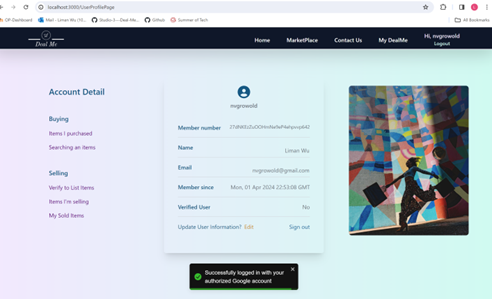

# Deal Me - Marketplace Web Application (React + Firebase)

Deal Me connects buyers and sellers in a friendly and simple marketplace where every deal is an opportunity. Users can list products, browse items, and make purchases, while admins and verified users manage listings through role-based access controls.

## Overview

- Multi-user eCommerce platform
- User registration, verification, and login
- Listing products with images and descriptions
- Shopping cart, checkout, and QR code order summary
- Order history and profile management
- Admin dashboard for user and listing management
- Hosted on Firebase

## Technologies

- React.js
- Firebase Authentication
- Firebase Firestore
- Firebase Storage (Images)
- Firebase Hosting
- React Router
- GitHub version control

## Features

### User Roles

- **General Guests:**  
  - Browse products without login
  - View product details and filter/search items

- **Registered Users:**  
  - Login with email/password or Google authentication
  - Create user profile
  - Add products to cart and proceed to checkout
  - View purchase history

- **Verified Users:**  
  - Apply for verification
  - Create new product listings
  - Edit and delete own listings

- **Admin Users:**  
  - Private route for admin login
  - Manage users and enable/disable their listing rights
  - View admin dashboard (total users, orders, top sellers)
  - User verification management

### Product and Order Management

- Add products with categories, regions, price and description
- View all products and product detail pages
- Filter products by category, price, region and keywords
- Add to cart and checkout
- Generate QR code for order confirmation
- View purchased and sold items

### Profile and User Management

- View and edit username and display name
- Password reset via email
- View "My Items" for products listed and sold
- Contact Us page to send messages to admin

### Admin Dashboard

- View total users, listings, and orders
- Manage user verification and ban/unban users
- View top commissioned users

## Screenshots





## How to Run

1. Clone this repository
2. Open terminal and run:

```bash
npm install
npm start
```
3. Application will run on http://localhost:3000
4. Setup Firebase project:
  - Add firebaseConfig to your project   
  - Set Firestore, Authentication and Storage rules

## Future Improvement

  - Add advanced search and filter capabilities
  - Implement messaging between buyers and sellers
  - Enable payment gateway integration

## Author

Liman Wu (Team Leader and Full Project Developer)
